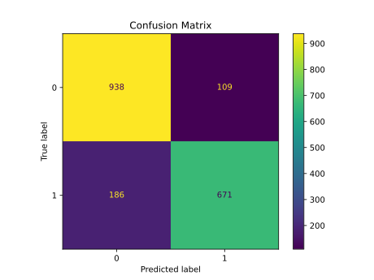
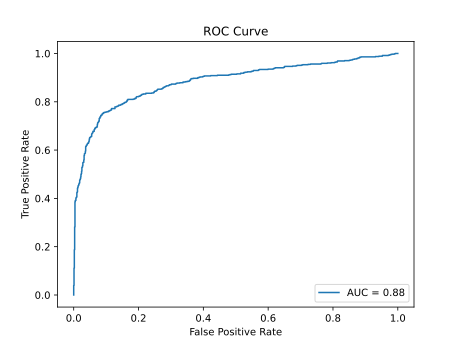

### Kaggle: [Natural Language Processing with Disaster Tweets](https://www.kaggle.com/competitions/nlp-getting-started/)

This task is a binary classification problem, identifying whether tweets are referring to genuine disasters. I fine-tuned a pretrained [RoBERTA](https://arxiv.org/abs/1907.11692) model from [Hugging Face](https://huggingface.co/roberta-base) using PyTorch. Since unnormalized location and keyword fields were supplied as well, I combined RoBERTA's output on all of these fields before the final classification layer.

# Results

The Kaggle test set F1 score was 0.825. Below is the performance of the model on a held out development test set of 1904 tweets.

|   | Precision | Recall | F1   | Support | Accuracy |
|---|-----------|--------|------|---------| -------- |
| 0 | 0.83      | 0.90   | 0.86 | 1047    |          |
| 1 | 0.86      | 0.78   | 0.82 | 857     |          |
|   |           |        |      |         | 0.85     |

